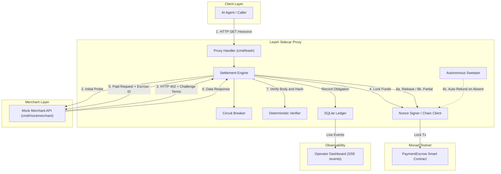
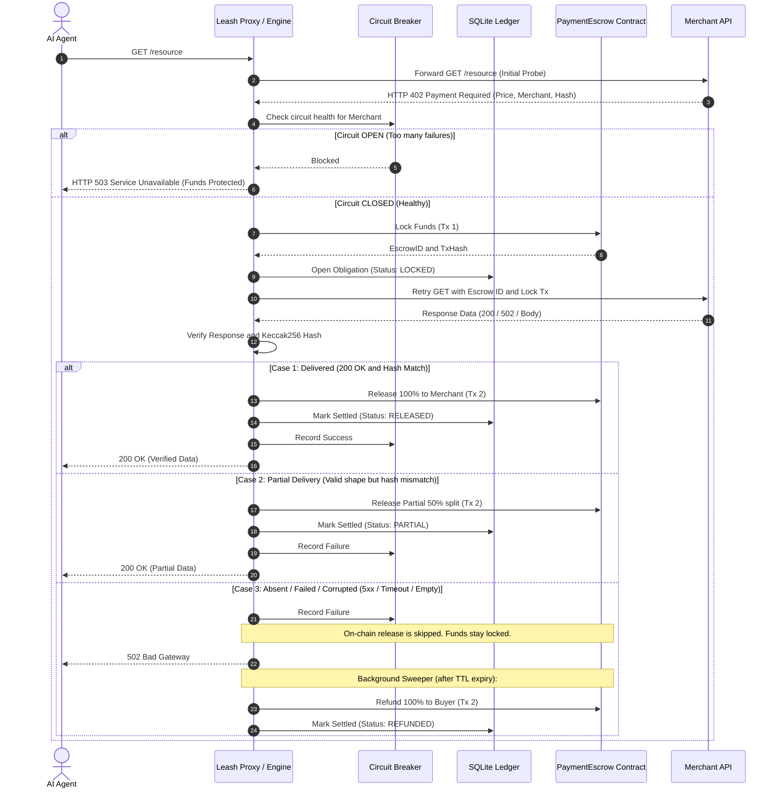

# Leash: Architecture & Flow Diagrams

This document outlines the end-to-end architecture, request lifecycle, and component interactions of the **Leash L3 Autonomous Escrow & Recovery Protocol**.

---

## 1. High-Level System Architecture

---

## 2. End-to-End Request & Settlement Flow (Sequence Diagram)

---

## 3. Core Component Breakdown

| Component | Path | Description |
| :--- | :--- | :--- |
| **Sidecar Server** | `cmd/leash/main.go` | HTTP reverse proxy, SSE streaming (`/events`), web dashboard routes, and management APIs. |
| **Settlement Engine** | `internal/engine/engine.go` | 402 challenge capture, escrow lifecycle execution, and automated sweeper loop. |
| **Deterministic Verifier** | `internal/engine/verify.go` | Verifies Keccak256 hash and response payload to produce a verdict (`Delivered`, `Partial`, `Absent`). |
| **Circuit Breaker** | `internal/engine/breaker.go` | Tracks merchant failure rates and trips (`503`) to protect agent funds from repeating failures. |
| **Chain Signer** | `internal/chain/escrow.go` | Manages nonces and executes smart contract transactions on Monad testnet. |
| **Smart Contract** | `contracts/src/PaymentEscrow.sol` | On-chain custody of escrow funds with programmatic release, partial release, and refund logic. |
| **SQLite Ledger** | `internal/ledger/ledger.go` | Persistent state storage for obligations (`LOCKED`, `RELEASED`, `REFUNDED`, `PARTIAL`). |
