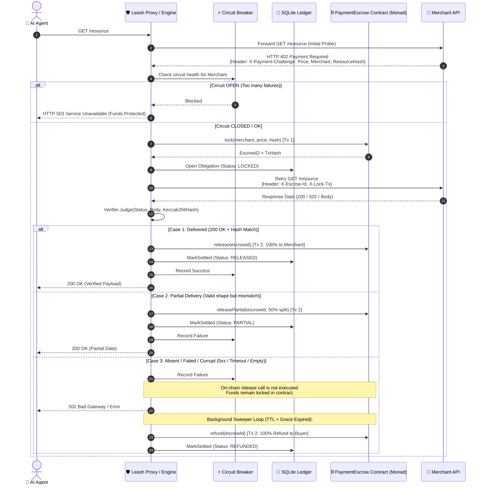

# Leash: Architecture & Flow Diagrams

This document outlines the end-to-end architecture, request lifecycle, and component interactions of the **Leash L3 Autonomous Escrow & Recovery Protocol**.

---

## 1. High-Level System Architecture

```mermaid
flowchart TD
    subgraph Client["🤖 Client Layer"]
        Agent["AI Agent / Caller<br/>(cmd/agent)"]
    end

    subgraph Sidecar["🛡️ Leash Sidecar Proxy (:8080)"]
        Proxy["Proxy Handler<br/>(cmd/leash/main.go)"]
        Engine["Settlement Engine<br/>(internal/engine/engine.go)"]
        Breaker["Circuit Breaker<br/>(internal/engine/breaker.go)"]
        Verifier["Deterministic Verifier<br/>(internal/engine/verify.go)"]
        Ledger[("SQLite Ledger<br/>internal/ledger")]
        Sweeper["Autonomous Sweeper<br/>(Background Ticker)"]
        ChainSigner["Nonce Signer / Chain Client<br/>(internal/chain)"]
    end

    subgraph Merchant["🏪 Merchant Layer"]
        API["Mock Merchant API (:8081)<br/>(cmd/mockmerchant)"]
    end

    subgraph Blockchain["⛓️ Monad Testnet (L3 Escrow)"]
        Contract["PaymentEscrow.sol<br/>(Smart Contract)"]
    end

    subgraph UI["📊 Observability"]
        Dashboard["Operator Dashboard<br/>(SSE /events & web/index.html)"]
    end

    Agent -->|1. HTTP GET /resource| Proxy
    Proxy --> Engine
    Engine --> Breaker
    Engine -->|2. Initial Probe| API
    API -->|3. HTTP 402 + Challenge Terms| Engine
    Engine -->|4. Lock Funds| ChainSigner
    ChainSigner -->|lock() Tx| Contract
    Engine -->|Record Obligation| Ledger
    Engine -->|5. Paid Request + Escrow-ID| API
    API -->|6. Data Response| Engine
    Engine -->|7. Verify Body & Hash| Verifier
    Engine -->|8a. release() / 8b. releasePartial()| ChainSigner
    Sweeper -.->|8c. refund() after TTL on Absent| ChainSigner
    Ledger -->|Live Events| Dashboard
```

---

## 2. End-to-End Request & Settlement Flow (Sequence Diagram)



---

## 3. Core Component Breakdown

| Component | Path | Description |
| :--- | :--- | :--- |
| **Sidecar Server** | `cmd/leash/main.go` | HTTP reverse proxy, SSE streaming (`/events`), web dashboard routes, and management APIs. |
| **Settlement Engine** | `internal/engine/engine.go` | 402 challenge capture, escrow lifecycle execution, and automated sweeper loop. |
| **Deterministic Verifier** | `internal/engine/verify.go` | Verifies Keccak256 hash and response payload to produce a verdict (`Delivered`, `Partial`, `Absent`). |
| **Circuit Breaker** | `internal/engine/breaker.go` | Tracks merchant failure rates and trips (`503`) to protect agent funds from repeating failures. |
| **Chain Signer** | `internal/chain/escrow.go` | Manages nonces and executes smart contract transactions on Monad testnet. |
| **Smart Contract** | `contracts/src/PaymentEscrow.sol` | On-chain custody of escrow funds with programmatic release, partial release, and refund logic. |
| **SQLite Ledger** | `internal/ledger/ledger.go` | Persistent state storage for obligations (`LOCKED`, `RELEASED`, `REFUNDED`, `PARTIAL`). |
